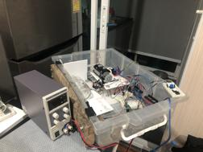

# BottleIdentifier
Project as part of an embedded Software class. The objective is a machine that can detect if there is even a glass or a plastic bottle in the box

---
## Overview
1. Classification

1.1 Classifer using machine learning

1.2 Classifier module

1.3 Hardness module

1.4 Weight module

1.5 Height module

2.1 Bin Module

2.2 Bin Algorithm

2.3 Data Communication

## 1.1 Classifier using Machine learning

A machine learning algorithm was built with the python library tensorflow.keras. From the lower part of this page described sensor modules 5 values are obtained.
The height, the diameter and the weight are summarized to a new value "weightByScale" to create a stronger independent and more informative variable. The three
remaining values are then scaled on a scale from 0-10 and fed to the prediction model.

The model was trained and tested on a dataset from 21 real world cases for 200 epochs. The assumption of an overfitting is with that less train cases not far, but since the data are strong enough to identify a bottle clearly this is no problem at the current status. For a "smarter" model more datas have to be obtained. 
Further this approach allows an easy extension on more type of bottles.

---

## 1.2 Classifier module

### Userinterface 
Prints out:
- All by the height, weight and hardness sensor obtained values
- Bin capacity status
- Prediction result

### 1.3 Hardness Measurement
A DC Motor pushes over a linear translation against the bottle. A force sensitive resistor at the top can obtain the pressure and
the DC Motor encoder enables to track the position. The measurement is conducted in five steps:
1. Find the zero position
2. Push with the minimum force against the bottle and save the position
3. Pull back for a short term
4. Push with 80% of the possible power from the DC motor against the bottle and save the measured force and position

Three Values can be obtained in this process:
- The diameter by substracting the first position with the zero position
- The deformation of the bottle by substracting the end position in step 4. with the first position
- The force that pushs against the bottle at 80% power
 

### 1.4 Weight Measurement
- We use the [Load Cell (0-5 kg.) and Amplifier]() with the [HX711_ADC]() Library. 
- Calibartion value is set to -419.37 after we tare with known weight.
- This module return the value in unit of gram.

## 1.5 Height Measurement
Since the bottle is placed into box which we know the length(34 cm), we install the [Ultrasonic Sensor]() in one side of the box in order to get the height value. 
- Height = Max length(34 cm) - Sensor_value(cm)

### 1.6 Communication
- Software Serial between Arduino Uno and ESPino32 for sending measured value and receiving prediction result.
- WIFI commnication between ESPino32 to server for POST the value and return the prediction result.

---
## 2.1 Bin Module
In this module, we try to send to status of the Bin to server. This status will report either the bin capacity either 50% or 100%. We use the components as following
- ATMega 
- ESPino32
- [SRF Ultrasonic range finder](https://www.robot-electronics.co.uk/htm/srf10tech.htm) x 2

### 2.2 Bin Algorithm
When we fit the sensor into the box, we get the maximum width of the box (13-15cm). If we put the object close to the sensor, it gives us the value over maximun width. Therefore, if the sensor returns the value in a range 0-12 or greater than 15, it means there are some objects placed in the same level on sensor.

### 2.3 Data Communication
There are two communication in this module. (Serial communication between ATMeaga and ESP and Internet communication between ESP and server)
- Serial Communication: we use the SoftwareSerial library to send data to ESP. This library convert the digital port into serial port for communication.
- Internet Communication: we use the HTTPClient to POST the value into the server.

All of the communication pack the data in JSON format and send to the receiver.

